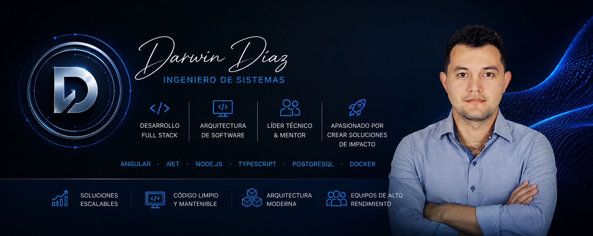

# 👋 Soy Darwin Díaz Mejia

## Technical Lead Angular | Senior Full Stack Developer

Ingeniero de Sistemas colombiano con más de 8 años de experiencia desarrollando soluciones empresariales para sectores de alta criticidad, especialmente en el ámbito financiero y corporativo.

Me especializo en el desarrollo frontend con Angular, aportando una visión Full Stack que me permite comprender el ciclo completo del producto, colaborar con equipos multidisciplinarios y participar activamente en decisiones técnicas orientadas a generar valor de negocio.

A lo largo de mi trayectoria he asumido responsabilidades propias de un liderazgo técnico, incluyendo revisión de código, acompañamiento a desarrolladores, análisis de requerimientos, estimaciones y apoyo en la toma de decisiones técnicas. Actualmente continúo fortaleciendo mis capacidades arquitectónicas y de liderazgo para evolucionar formalmente hacia posiciones de Technical Lead.

## 🛠️ Tech Stack

### Frontend (Especialidad)

### Backend

### Bases de Datos

### Cloud, DevOps y Herramientas

### Testing y Calidad

### IA y Aprendizaje Continuo

---

## 💡 Fortalezas Profesionales

- Angular Enterprise Development.
- Frontend Architecture & Scalability.
- Technical Decision Making.
- Code Reviews & Mentoring.
- REST API Integration.
- Cross-functional Collaboration.
- Business-Oriented Solutions.
- Financial Sector Experience.
- Continuous Learning Mindset.
- Problem Solving with a Pragmatic Approach.

---

## ⭐ Proyectos Destacados

### 🤖 Smart Workforce AI

Plataforma Full Stack orientada a la gestión y automatización de procesos empresariales mediante inteligencia artificial. El proyecto funciona como laboratorio técnico para aplicar arquitectura de software, desarrollo backend y frontend, integración de IA generativa y buenas prácticas de ingeniería, evolucionando progresivamente hacia una solución empresarial mantenible y escalable.

**Tecnologías:** Angular · TypeScript · .NET · ASP.NET Core · REST APIs · Clean Architecture · DDD · Generative AI

🔗 Repositorio: https://github.com/darwindiaz/smart-workforce-ai

---

### 🛒 E-Commerce MVP

Aplicación Full Stack desarrollada para demostrar la construcción de una solución empresarial completa, desde la arquitectura frontend hasta la integración con servicios backend. Incluye autenticación y autorización, consumo de APIs REST, gestión de estado, persistencia, pruebas y una estructura orientada a mantenibilidad y escalabilidad.

**Tecnologías:** Angular · TypeScript · RxJS · .NET · ASP.NET Core · Entity Framework Core · JWT · REST APIs · xUnit

🔗 Repositorio: https://github.com/darwindiaz/ecommerce-net-angular-mvp

---

### 🎟️ Eventos Frontend

Aplicación frontend desarrollada con Angular como parte de proyectos anteriores, enfocada en la construcción de interfaces reutilizables, gestión de formularios, consumo de servicios y organización modular de aplicaciones.

**Tecnologías:** Angular · TypeScript · RxJS · Angular Material · HTML · CSS

🔗 Repositorio: https://github.com/darwindiaz/eventos-front

---

### ⚙️ Eventos Backend

API REST desarrollada con Java y Spring Boot para la gestión de eventos y reglas de negocio. El proyecto representa experiencia práctica en desarrollo backend, diseño de servicios REST e integración con persistencia y servicios cloud.

**Tecnologías:** Java · Spring Boot · REST APIs · MySQL · AWS

🔗 Repositorio: https://github.com/darwindiaz/eventos-back

---

### ☁️ Infrastructure as Code

Repositorio orientado al aprendizaje y experimentación con infraestructura como código y servicios cloud. Forma parte de mi proceso de fortalecimiento en prácticas DevOps y arquitectura de infraestructura.

**Tecnologías:** Terraform · AWS

🔗 Repositorio: https://github.com/darwindiaz/terraform

## 🧪 Learning & Innovation Lab

Este espacio representa mi laboratorio técnico personal, orientado a la experimentación, el aprendizaje aplicado y el fortalecimiento continuo de capacidades profesionales.

A través de iniciativas propias exploro nuevas tecnologías, evalúo herramientas emergentes y construyo soluciones prácticas que complementan mi experiencia empresarial. Mi objetivo es mantenerme actualizado y desarrollar una visión cada vez más amplia como profesional y futuro líder técnico.

Actualmente exploro iniciativas relacionadas con:

- 🤖 Inteligencia Artificial aplicada al desarrollo de software.
- ⚙️ Automatización de procesos y productividad.
- 🏗️ Arquitecturas escalables y mantenibles.
- ☁️ Cloud y observabilidad.
- 🚀 Soluciones SaaS orientadas a negocio.
- 📚 Aprendizaje continuo basado en la práctica.

## 🤝 Mi Enfoque Profesional

Disfruto transformar requerimientos complejos en soluciones mantenibles, escalables y orientadas a resultados. Me motiva generar impacto real en el negocio, facilitar acuerdos técnicos y contribuir al crecimiento de los equipos con los que colaboro.

A lo largo de mi trayectoria he participado activamente en revisiones de código, análisis de requerimientos, estimaciones y acompañamiento técnico a otros desarrolladores, fortaleciendo progresivamente capacidades propias del liderazgo técnico.

Creo en el aprendizaje continuo, las decisiones pragmáticas y el equilibrio entre calidad técnica y entrega de valor. Mi objetivo es evolucionar hacia posiciones formales de **Technical Lead**, aportando tanto desde la ejecución técnica como desde la colaboración y el acompañamiento de equipos.

## 📫 Contacto

💼 **LinkedIn:** https://www.linkedin.com/in/darwin-diaz/

💻 **GitHub:** https://github.com/darwindiaz

📍 **Ubicación:** Colombia

📧 **Disponibilidad:** Abierto a oportunidades remotas e híbridas alineadas con roles de Technical Lead Angular, Senior Frontend y Senior Full Stack.

---

> Siempre estoy dispuesto a conectar con profesionales del sector, compartir aprendizajes y explorar oportunidades donde pueda generar impacto y continuar creciendo profesionalmente.
